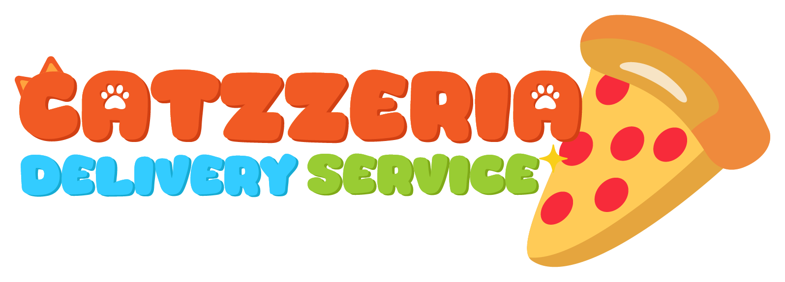
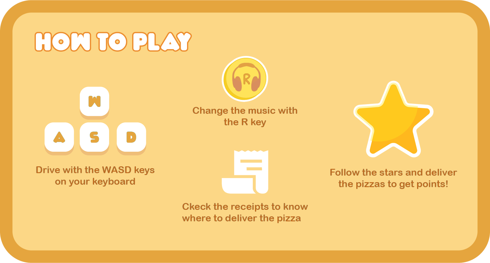

### Project developed by GalPixel Studios

Welcome to the **Catzzeria Delivery Service** repository! This is our submission for the [**Game Jam + 24/25**](https://gamejamplus.com/). In this 3D game, you take on the role of a cat delivering pizzas on a motorcycle while exploring a city that's randomly generated each game. Enjoy lo-fi music and customize your bike for a relaxing and unique experience.

---

## Development Team 👥

Our team at GalPixel Studios is made up of talented developers and artists who have put their creativity and effort into this project.

### Team Members 🥇:

- [**Sebastián Escobar**](https://www.linkedin.com/in/sebastianescobart/) - 2D Artist 🎞️  
  Responsible for illustrations, animations and visual designs that bring the scenes and characters to life.

- [**Majo Rincón**](https://drive.google.com/drive/folders/1-8OdcF5O1SF8xe0EKNtE00oYpPr73qwv) - 3D Artist 🐱  
  In charge of 3D models, ensuring the world of Catzzeria comes alive with detail.

- [**Andrés Bonilla**](https://www.linkedin.com/in/andres-bonilla-galindo/) - Level Designer 👾  
  Creator of the levels, world building and player movement.

- [**Juliana Loaiza**](https://youtu.be/6yCzQz8Hqss?si=B5OeUU_pQIcHlH1g) - Postprocessing 📸  
  Responsible for final visual effects, optimizing the game's visual experience. 

- [**Juan Pablo Martínez**](https://www.linkedin.com/in/jpablo-martinez/) - Game Designer 🕹️  
  Responsible for the overall game design, mechanics, and gameplay balance. Also programmer.

- [**Felipe Aristizábal**](https://www.linkedin.com/in/felipearistizabal/) - Game Developer 🤖  
  Lead programmer, co-creator of the the random generation of customer houses in each session

- [**Luisa Guzmán**](https://drive.google.com/drive/folders/1u9nwwitav-op0k_Buubmd1i5FTUgDSYP) - UI/UX Designer 🎨  
  Responsible for user interface design, ensuring intuitive and enjoyable game interaction.

---

## Main Features 🎭

- Customize your motorcycle and freely explore a city with randomly generated houses.
- Relax with a "chill" game experience accompanied by lo-fi music.
- Deliver pizzas to various customers with different houses each session, making each game unique.
- New features and bugs solved soon...

---

## To play it 🎮

You can visit our page on [**itch.io**](https://pablitoh5.itch.io/catzzeria) and leave a comment of what you thought about it.

---

## How to play ❓

---
## Assets Taken 📄

During the development of **Catzzeria Delivery Service**, some third-party assets were used. Below is a doc where you can find all links ant others sources:

- **[Doc](https://docs.google.com/document/d/1vZOdW0YeLkDJhxtuUmXQh1HHrrP92fcovn8rO9pwvys/edit?usp=sharing)**  

